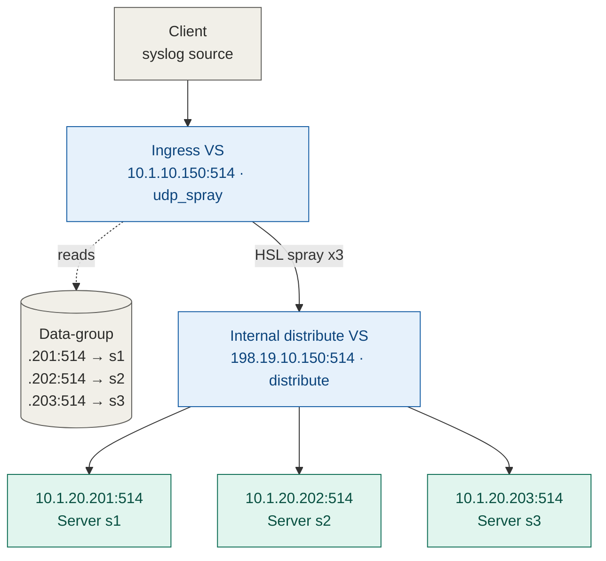
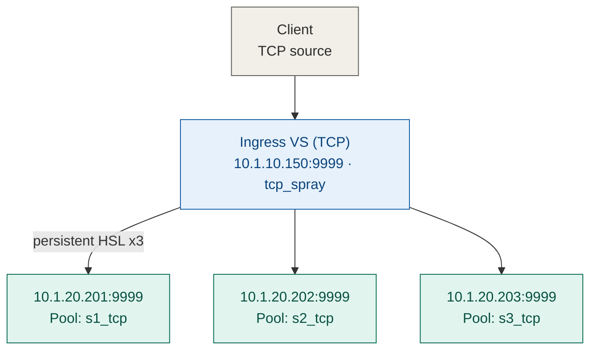
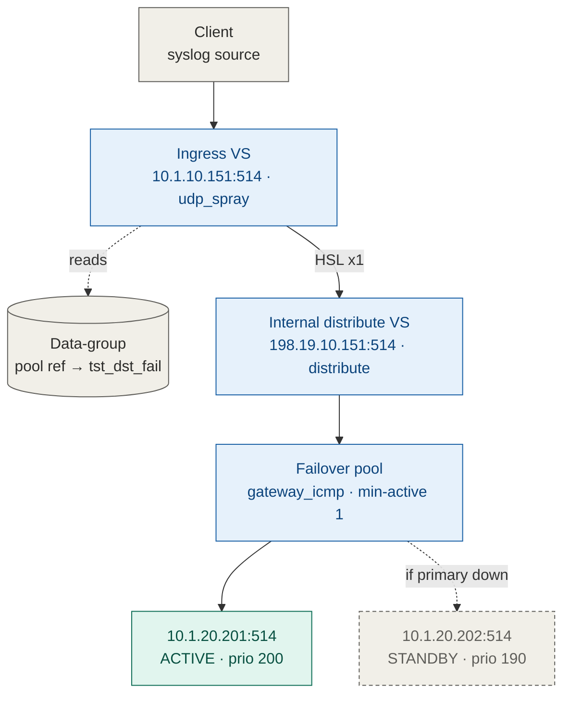
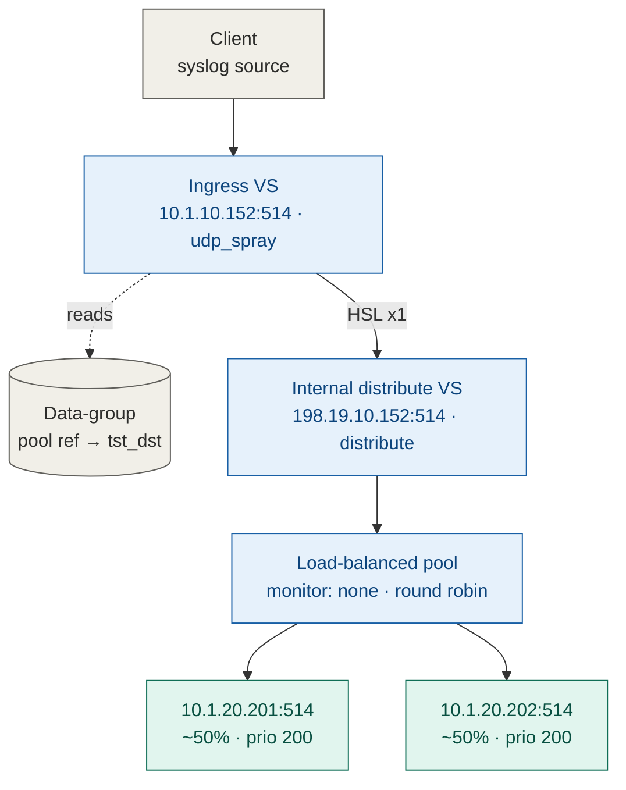

# UDP/TCP packet duplication — modernization walkthrough

DevCentral codeshare update: `f5.traffic_duplication`

---

## Summary

### What changed from the original template

- **Dual-stack IPv4/IPv6 and route domains.** The original was hardcoded to IPv4 dot-decimal addressing, a fixed `255.255.255.255` netmask, and colon-delimited endpoints. The rebuild adds dynamic netmasks, route domain (`%rd`) preservation, and endpoint formatting that adapts per family — dot notation for IPv6, colon notation for IPv4.
- **Header serialization and performance.** The original packed the client IP/destination/payload into a fixed 256-byte binary `ssssa256` structure, which caused UTF-8 string shimmering, extra memory allocation, and payload truncation. The rebuild uses a lightweight delimited string format (`ClientIP#Destination#Payload`) parsed with C-level `memchr` routines — over 16x faster with no data corruption.
- **TCP duplication efficiency.** The original opened a new HSL TCP handle on every `CLIENT_DATA` event. The rebuild pre-opens and pools the HSL handles once in `CLIENT_ACCEPTED`, so the data path is just a lightweight list iteration.
- **Monitoring and failover.** Replaced monitor assumptions that broke across TMOS versions with universal `gateway_icmp` monitoring and priority-group failover logic that behaves consistently on TMOS 17.1, 17.5, and 21.1.
- **Tooling and test automation.** Manual CLI deployment and static presentation scripts were replaced with a full automation suite — per-version deploy scripts (`deploy_171.sh`, `deploy_175.sh`, `deploy_211.sh`), a multi-node virtual-wire test harness, and automated PCAP payload validation.

### Troubleshooting along the way

- **IPv6 port formatting errors.** Deployments failed on addresses like `fdf5::1:1:1:1:514` because the port looked missing. Fixed by branching endpoint formatting: `addr.port` for IPv6, `addr:port` for IPv4.
- **Virtual server collisions (01070333:3).** Running multiple test app services at once threw conflicts on destination IP/port/protocol/VLAN. Fixed by allocating unique VIPs per test suite and keeping each app service's internal distribution VS cleanly separated.
- **Missing ICMPv6 monitor (01070022:3).** TMOS 17.1 doesn't ship `/Common/icmpv6`, so deployments failed. Standardized every script and template on `/Common/gateway_icmp`, which natively probes both IPv4 and IPv6.
- **TCP source IP parity check.** Needed to confirm TCP spray was ever supposed to preserve the client's source IP. Verified against the original 2015 source: it never did — TCP spray has always originated from the BIG-IP self IP because of the stateful TCP three-way handshake. Current behavior is fully consistent with the original design.

---

## `app_udp_single` — single-server spray

The data-group keys are the real destination endpoints; the values are just the friendly names from the app service table. The spray iRule loops over the keys to decide how many copies to send. With a single server per destination and no pools involved, the distribute iRule forwards straight to `node <ip> <port>`, preserving the client's source IP via SNAT.

---

## `app_tcp_spray` — direct HSL fan-out

No internal loopback VS and no data-group here — pool names are compiled straight into the iRule at build time. Three HSL TCP handles open once in `CLIENT_ACCEPTED` and every `CLIENT_DATA` chunk streams to all three simultaneously. Per the parity check above, this path has never preserved the client's source IP — destinations see the BIG-IP self IP, by original design.

---

## `app_udp_failover` — active/standby

The two servers collapse into one failover pool, so the data-group holds a *pool name* instead of a raw endpoint, and the distribute iRule hands off to native LTM pool selection with `pool $destination`. The solid edge is the normal path; the dashed edge only carries traffic once `gateway_icmp` marks `.201` down and priority-group 200 alone can't satisfy `min-active-members 1`.

---

## `app_udp_lb` — even load balancing

Structurally identical to the failover case, but both members share priority-group 200 and there's no health monitor — so BIG-IP round-robins evenly with no active/standby distinction. Same iRule code path as failover; the behavior split comes entirely from `operationmode` and whether `basic__monitor` is set in the app service config.
